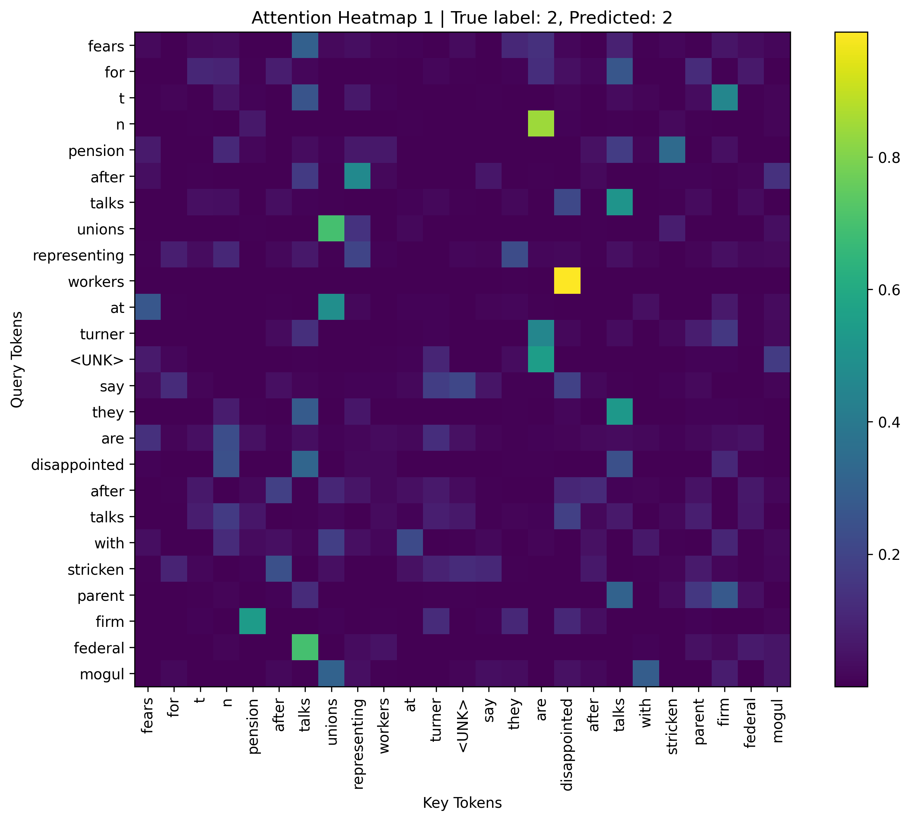
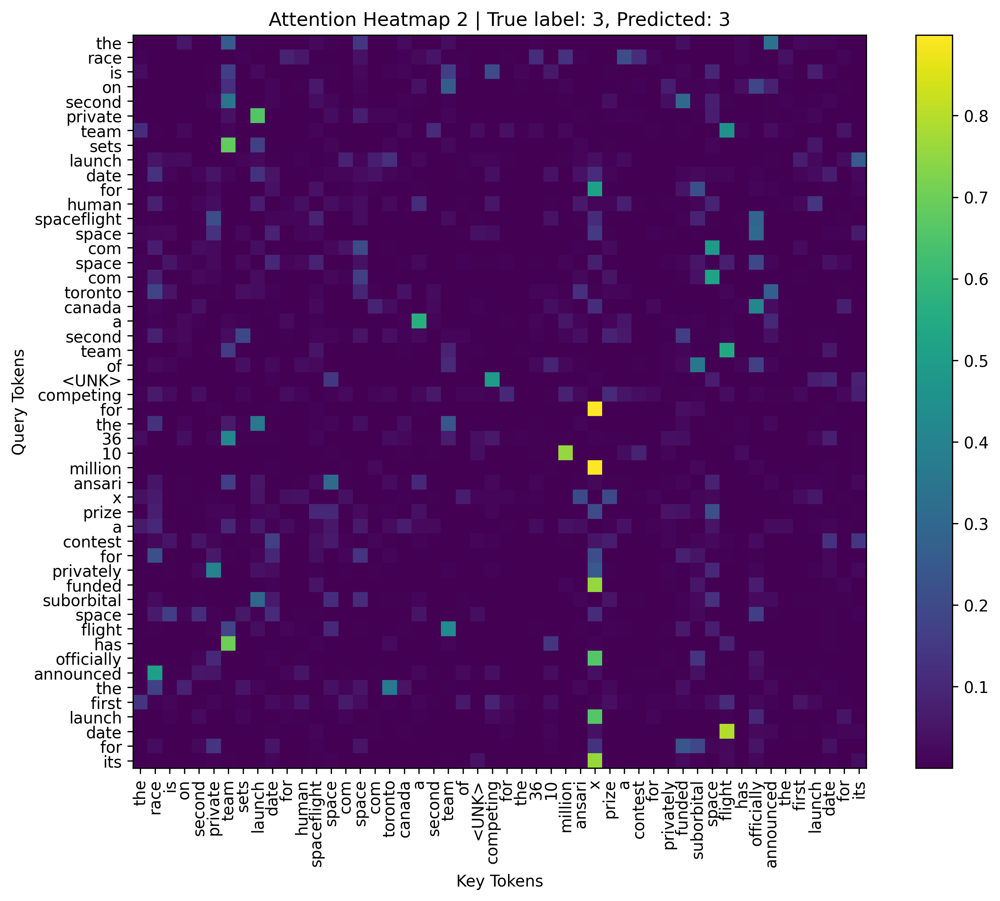
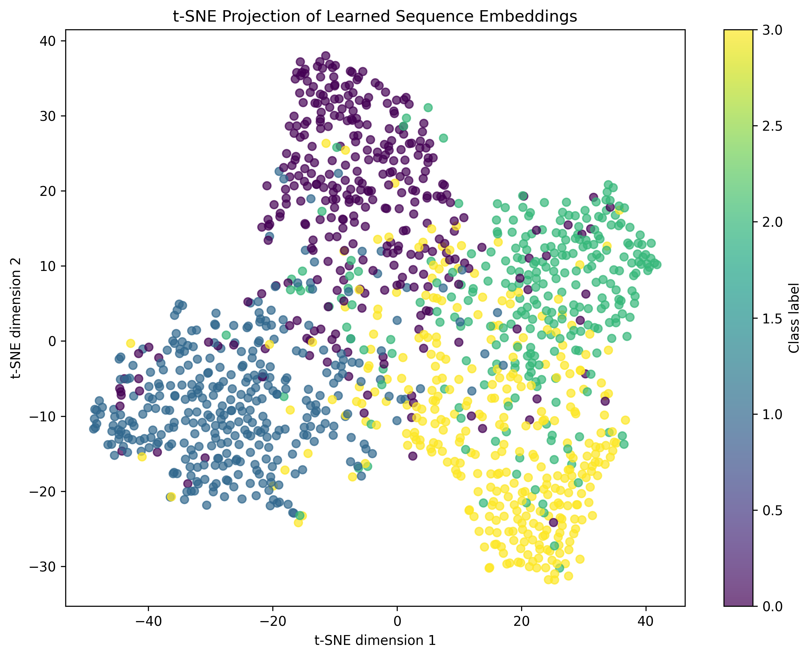

# Self-Attention for Text Classification

This project implements a compact Transformer-style text classifier from scratch in PyTorch and evaluates it on AG News. It isolates the core mechanics of self-attention before moving to the image-attention experiment in Assignment 6.

## What it demonstrates

- Regex tokenization, vocabulary construction, and fixed-length sequences
- Token and positional embeddings
- Single-head scaled dot-product self-attention
- Mean pooling for sequence classification
- Attention heatmap and t-SNE visualizations

The model was trained on a 10,000-example subset for five epochs. The recorded run reached `95.52%` training accuracy and `75.05%` test accuracy, showing useful learned representations alongside some overfitting. The gap between the two values is a practical reminder that fitting the training subset does not guarantee equally strong generalization.

## Results



Additional outputs: `attention_heatmap_2.png` and `sequence_embeddings_tsne.png`.





The heatmaps show which tokens receive attention for selected examples, while the t-SNE plot visualizes the learned sequence embeddings and their class structure.

## Run

```bash
python -m venv .venv
# Windows
.venv\Scripts\activate
# macOS/Linux: source .venv/bin/activate
pip install -r requirements.txt
python 05_self_attention_text.py
```

AG News is downloaded or prepared by the script as required. The generated visualizations are saved in the project directory.